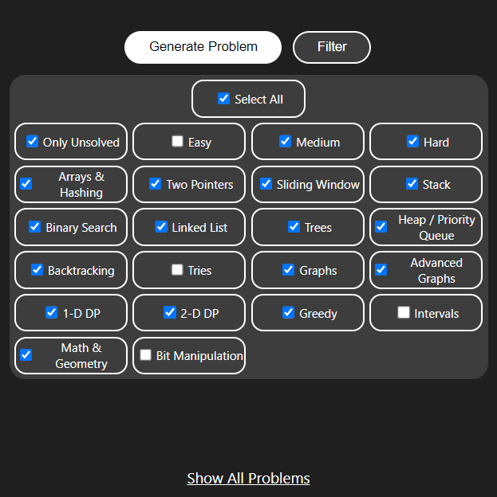
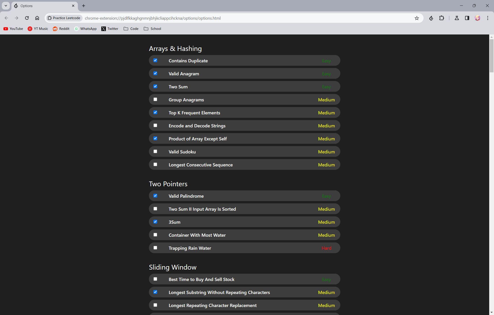
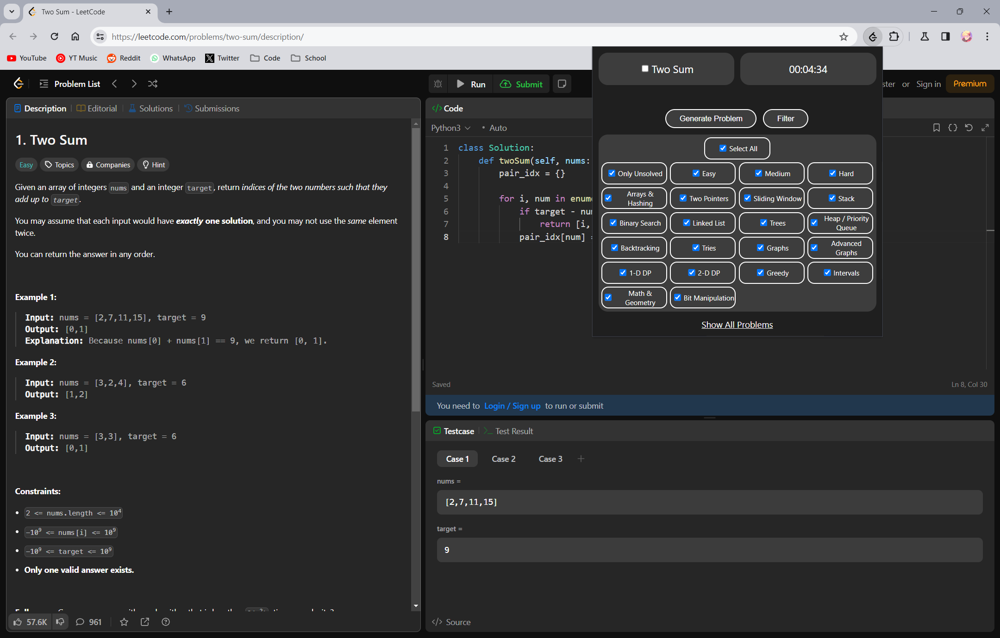

# Practice Leetcode

A browser extension that helps you practice and track your progress on the top 150 LeetCode Problems.

Solve a specific problem or generate a random one from any category/difficulty from the NeetCode 150 problem list.

Has an inbuilt counter that stops only when you submitted a correct solution which passes all the testcases.

Automatically tracks if the problem is solved or not and updates it in the list.

## Installation

1. Clone or Download/Unzip the repo.
2. Go to `chrome://extensions`(or `edge://extensions` for edge users) and turn on 'Developer Mode' in the top right.
3. Click on 'Load Unpacked' and select the folder of the extension.